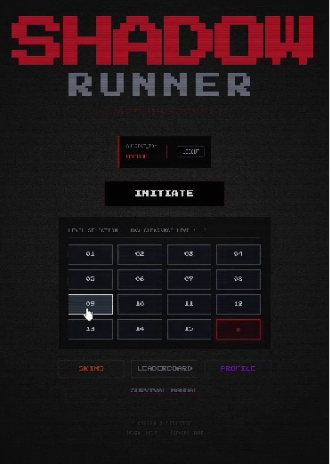
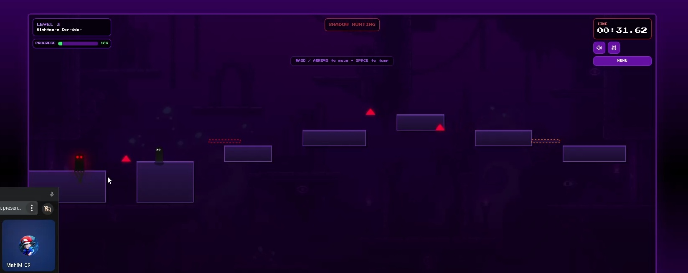
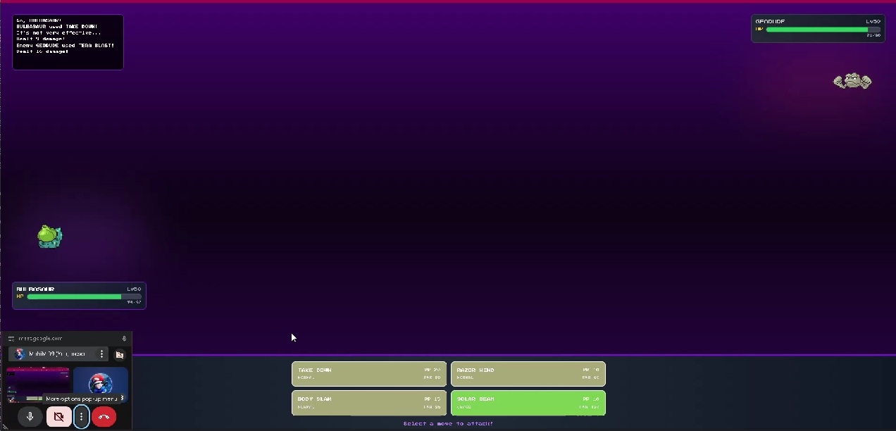
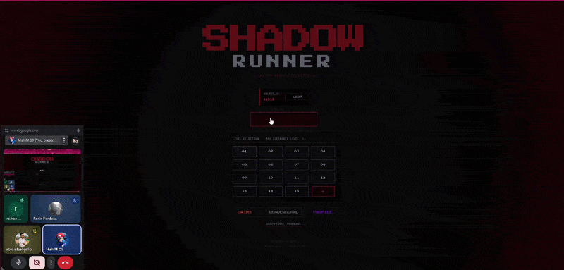
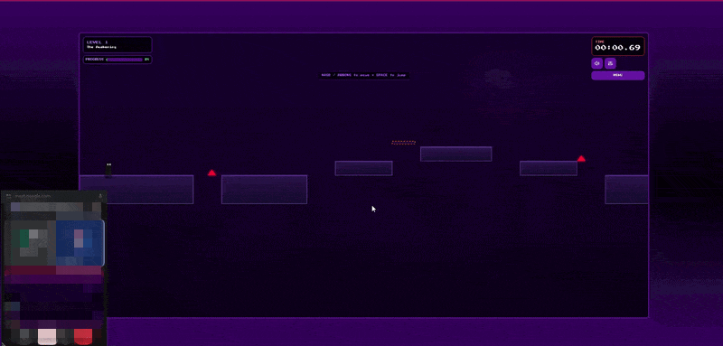
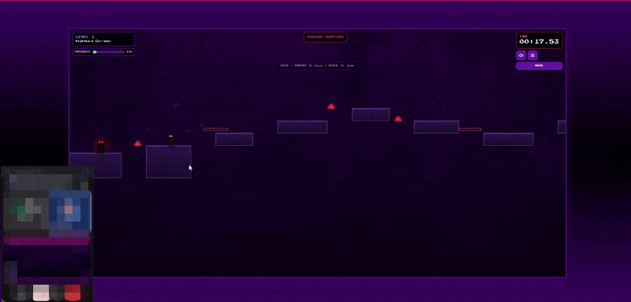

<div align="center">
## Shadow Runner

> A browser-based platformer with Pokémon-style turn-based battles and an adaptive shadow pursuer.


</div>

## About

Shadow Runner is a full-stack web game that combines side-scrolling platforming with turn-based Pokémon-style combat. Players navigate dungeon-style levels while a shadow enemy spawns and pursues them. Catching or engaging the shadow triggers a battle; progression depends on reaching the exit or winning the fight.

The project includes a React frontend (Canvas rendering), a Spring Boot REST/WebSocket backend, and a PostgreSQL database for levels, accounts, leaderboards, battle logs, and AI training data.

## Features

- **16 hand-authored levels** stored in PostgreSQL (`backend/database_schema.sql`), with procedural fallback generation in the frontend for missing level data
- **Platforming hazards** including spikes, fake floors, moving traps, timed traps, teleport hazards, and boss phases
- **Shadow pursuer** that spawns after 15 seconds (`SHADOW_SPAWN_DELAY` in `useGameEngine.ts`)
- **Turn-based Pokémon-style battles** with type effectiveness, STAB, and damage calculation (`frontend/src/types/game.ts`)
- **PokeAPI integration** for Pokémon data (`app.pokemon-api-base-url` in `application.properties`)
- **Naïve Bayes move prediction** on the backend (`AIService.java`) with counter-move selection
- **WebSocket multiplayer sync** at `ws://localhost:8081/api/ws/game`
- **Leaderboards and player stats** persisted via REST API
- **Account system** with JWT authentication (Spring Security)
- **8 player skins** (Shadow, Crimson, Ocean, Forest, Royal, Solar, Blood, Void)

## Screenshots

| Main Menu | Gameplay | Battle |
|-----------|----------|--------|
|  |  |  |

## Videos

| Main Menu | Gameplay | Battle |
|-----------|----------|--------|
|  |  |  |

## Tech Stack

| Layer | Technology | Version (from project files) |
|-------|------------|------------------------------|
| Frontend | React, TypeScript, Vite | React 18.3.1, TS 5.5.3, Vite 5.4.1 |
| UI | Tailwind CSS, shadcn/ui (Radix) | Tailwind 3.4.11 |
| Backend | Spring Boot (Web, WebSocket, JPA, Security) | 3.2.0 |
| Language | Java, TypeScript | Java 21, TypeScript 5.5 |
| Database | PostgreSQL | 15+ (driver 42.7.1) |
| Build | Maven, npm | Maven (via wrapper or local install) |
| External API | PokeAPI | `https://pokeapi.co/api/v2` |

## Prerequisites

Install the following before running locally:

| Software | Required version |
|----------|------------------|
| [Node.js](https://nodejs.org/) | 18+ (LTS recommended) |
| [Java JDK](https://adoptium.net/) | 21 |
| [Apache Maven](https://maven.apache.org/) | 3.9+ |
| [PostgreSQL](https://www.postgresql.org/) | 15+ (or Docker) |
| [Git](https://git-scm.com/) | Any recent version |

## Installation

1. Clone the repository:

```bash
git clone https://github.com/m09xd/ShadowRunner.git
cd ShadowRunner
```

2. Start PostgreSQL and create the database. Example with Docker:

```bash
docker run --name Shadow_Runner \
  -e POSTGRES_DB=ShadowRunner \
  -e POSTGRES_USER=SRpostgres \
  -e POSTGRES_PASSWORD=SRpostgres \
  -p 54969:5432 \
  -d postgres:15
```

3. Load the schema and seed data:

```bash
psql -h localhost -p 54969 -U SRpostgres -d ShadowRunner -f backend/database_schema.sql
```

4. Build the backend:

```bash
cd backend
mvn clean package
cd ..
```

5. Install frontend dependencies:

```bash
cd frontend
npm install
cd ..
```

## How to Run

### Option A — Windows launcher (recommended on Windows)

From the project root:

```bat
RUN.bat
```

This script checks Java/npm, starts the backend JAR on port **8081**, starts the Vite dev server on port **8080**, and opens `http://localhost:8080`.

> **Note:** `RUN.bat` expects `backend/target/shadow-runner-1.0.0.jar` to exist. Run `mvn clean package` in `backend/` first if the JAR is missing.

### Option B — Manual (two terminals)

**Terminal 1 — Backend** (port 8081, context path `/api`):

```bash
cd backend
mvn spring-boot:run
```

Or run the packaged JAR:

```bash
cd backend
java -jar target/shadow-runner-1.0.0.jar
```

**Terminal 2 — Frontend** (port 8080, proxies `/api` to backend):

```bash
cd frontend
npm run dev
```

Open **http://localhost:8080** in your browser.

### Configuration

Backend defaults (`backend/src/main/resources/application.properties`):

| Setting | Default |
|---------|---------|
| Database URL | `jdbc:postgresql://localhost:54969/ShadowRunner` |
| DB username | `SRpostgres` (override with `DB_USERNAME`) |
| DB password | `SRpostgres` (override with `DB_PASSWORD`) |
| Server port | `8081` |
| API base path | `/api` |

Frontend dev server (`frontend/vite.config.ts`):

| Setting | Value |
|---------|-------|
| Port | `8080` |
| API proxy | `/api` → `http://localhost:8081` |

## Controls

| Input | Action |
|-------|--------|
| `A` / `←` | Move left |
| `D` / `→` | Move right |
| `W` / `↑` / `Space` | Jump (when grounded) |
| `Esc` | Pause / unpause (during gameplay) |
| Mouse click | Select Pokémon moves in battle |

## Project Structure

```
ShadowRunner/
├── frontend/                 # React + Vite client
│   ├── src/
│   │   ├── components/       # UI and game screens (MainMenu, GameCanvas, BattleScreen, …)
│   │   ├── hooks/            # Game engine, battle system, audio hooks
│   │   ├── lib/              # API client, WebSocket, Pokémon helpers
│   │   ├── types/            # Shared TypeScript types and constants
│   │   └── pages/            # Route entry pages
│   ├── public/               # Static assets
│   └── vite.config.ts        # Dev server (port 8080) and API proxy
├── backend/                  # Spring Boot server
│   ├── src/main/java/        # Controllers, services, entities, WebSocket handlers
│   ├── src/main/resources/   # application.properties, SQL resources
│   ├── database_schema.sql   # PostgreSQL schema + 16 level seed data
│   └── pom.xml               # Maven build (Java 21, Spring Boot 3.2)
├── RUN.bat                   # Windows one-click launcher
├── run.txt                   # Quick reference run commands
└── README.md
```

## Building a Release

**Frontend production build:**

```bash
cd frontend
npm run build
```

Output is written to `frontend/dist/`. Serve with any static host or `npm run preview`.

**Backend production JAR:**

```bash
cd backend
mvn clean package
```

Deploy `backend/target/shadow-runner-1.0.0.jar` with PostgreSQL configured via environment variables (`DB_USERNAME`, `DB_PASSWORD`, `JWT_SECRET`).

## Contributing

1. Fork the repository
2. Create a feature branch: `git checkout -b feature/your-feature`
3. Commit your changes with clear messages
4. Push to your fork and open a Pull Request against `main`

Please run `npm run lint` in `frontend/` and `mvn test` in `backend/` before submitting.

## License

License not yet specified. Add a `LICENSE` file when you choose one (MIT is a common choice for indie game projects).

## Contact

- **GitHub:** [@m09xd](https://github.com/m09xd)
- **Email:** mmahim2320084@bscse.uiu.ac.bd
